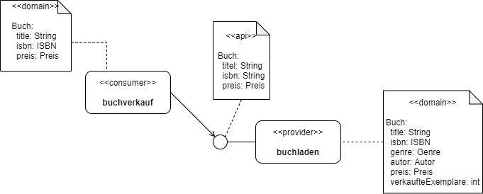

# Beispiel: Der Online-Buchladen

## Gesamtübersicht

In unserem Beispiel gibt es den Online-Buchladen (`buchladen`), über den die Autoren ihre Bücher einstellen können.

Daneben soll es später zwei Systeme, die die API des `buchladen` nutzen wollen - nämlich zum einen die Empfehlung `buchempfehlung` und den Buchverkauf `buchverkauf`.
Beide Systeme haben unterschiedliche Sichten und Verständnisse darüber, welche Eigenschaften ein Buch haben sollte.

Das System `buchverkauf` bietet eine Möglichkeit, Bücher über eine UI zu kaufen.

Des Weiteren gibt es den Konsumenten `buchempfehlung`. Seine Aufgabe ist es eine Übersicht für den Bücher-Interessenten zu schaffen, so dass dieser sich über aktuelle Bestseller informieren kann.

## Ausgangslage

Beginnen wir zunächst mit der Situation, dass der `buchladen` gerne seine Bücher verkaufen möchte. Hierzu wird der Consumer `buchverkauf` (von einem anderen Team) aufgesetzt und entwickelt.

Soweit ist alles klar und stabil. Doch was passiert, wenn im weiteren Verlauf zu Änderungen an der Schnittstelle kommt? Wie lässt sich sicherstellen, dass davon der `buchverkauf` nicht betroffen ist und weiterhin funktionsfähig bleibt, ohne dass hier ein ständiger Austausch mit dem Provider-Team erforderlich ist.

Eine mögliche Lösung ist `Consumer Driven Contract Testing`.

## Consumer Driven Contract Testing

### Motivation

Die Konsumenten haben zwei wesentliche Erwartung an die API des Buchladens:

1. Sicherstellen, dass die Schnittstelle des Providers die jeweils notwendigen Felder liefert
2. Im Falle von Releases neuer Versionen des Providers darf die Schnittstelle zum Consumer nicht brechen

Aus diesem Grund entscheiden sich, die Consumer mit dem Provider einen `Contract` im Sinne des `Consumer Driven Contract Testing` einzugehen.

### Funktionsweise

Wie CDCT mit `Pact` funktioniert, ist hier sehr anschaulich beschrieben:

https://pactflow.io/how-pact-works/?utm_source=ossdocs&utm_campaign=getting_started#slide-1

Wir haben nun verstanden, _warum_ die Consumer ein Interesse haben, mit dem Provider einen Contract auszuhandeln.
Jetzt wollen wir uns darum kümmern, _was_ dafür getan werden muss.

## Aufgaben

- [Aufgabe 0: Vorbereitung](#aufgabe-0-vorbereitung)
- [Aufgabe 1: Consumer - Contract definieren](#aufgabe-1-consumer-contract-definieren)
- [Aufgabe 2: Consumer - Contract erzeugen](#aufgabe-2-consumer-contract-erzeugen)
- [Aufgabe 3: Provider - Contract berücksichtigen](#)
- [Aufgabe 4: Provider - Contract verifizieren](#)
- [Aufgabe 5 Pact-Broker aufsetzen](#aufgabe-5-pact-broker-aufsetzen)
- [Aufgabe 6: Consumer - Contract auf Broker publizieren](#aufgabe-3-consumer-contract-auf-broker-publizieren)
- [Aufgabe 7: Provider - Contracts verifizieren](#)
- [Aufgabe 8: Provider - Deployment in Stage](#)
- [Aufgabe 9: Consumer - Can I deploy](#)

### Aufgabe 0: Vorbereitung

Für die nachfolgenden Übungen werden folgende Dinge benötigt:

1. Ein _Java Development Kit_ (kurz JDK) in Version >=11
2. Eine Entwicklungsumgebung für Java (bspw. IntelliJ, etc.)
3. Laden Sie sich dieses Repository (`buchladen`) von GitHub herunter
4. Da wir _Lombok_ einsetzen, sollte sichergestellt sein, dass das _Annotation Processing_ in der IDE aktiviert ist
5. Eine _Docker_-Maschine (für den Pact-Broker)

Wir wollen als Tooling `Pact` einsetzen. Hierzu müssen wir als erstes das Pact-Gradle-Plugin in unser Projekt aufnehmen.
Da das Gradle-Plugin sowohl auf der Consumer- als auch auf der Provider-Seite erforderlich ist, werden wir es im Root-Projekt konfigurieren.

_TODOs_

## Consumer Übersicht
Übersicht über alle Consumer, mit denen ein Contract vereinbart wurde

| Provider-ID | API-Version | Client-ID | Tag der Spec-Version | Consumer | Kontakt |
| --- | --- | --- | --- | --- | --- |
| buchladen-api | v1 | buchverkauf | buchladen-api-v1 | vertrieb | sales@example.com |
| buchladen-api | v1 | buchempfehlung | buchladen-api-v1 | empfehlung | recommendation@example.com |

## Nützliche Befehle
| System | was | Befehl |
| --- | --- | --- |
| Buchladen | `buchladen-app` starten | `gradlew -si -Pargs=--init :buchladen-app:bootRun` |
| BuchVerkauf | `buchverkauf-app` starten | `gradlew -si :buchverkauf-app:bootRun` |
| BuchEmpfehlung | `buchempfehlung-app` starten | `gradlew -si :buchempfehlung-app:bootRun` |

## Links
| System | was | Link |
| --- | --- | --- |
| buchladen-app | Swagger-UI | http://localhost:8090/swagger-ui.html |
| buchladen-app | OpenAPI Spec (Anzeige) | http://localhost:8090/api-docs/ |
| buchladen-app | OpenAPI Spec als Download (`yml`) | http://localhost:8080/api-docs.yaml |
| buchverkaufen-app | UI | http://localhost:8080 |
| buchempfehlung-app | UI | http://localhost:8081 |
