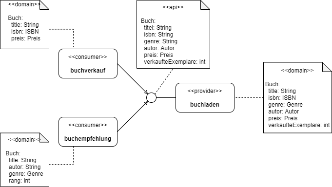

# Beispiel: Der Online-Buchladen


## Überblick

In unserem Beispiel gibt es den Online-Buchladen (`buchladen`), über den die Autoren ihre Bücher einstellen können.

Beginnen wir damit, dass der `buchladen` gerne seine Bücher verkaufen möchte. Hierzu wird der Consumer `buchverkauf` (von einem anderen Team) aufgesetzt und entwickelt.


Das System `buchverkauf` bietet eine Möglichkeit, Bücher über eine UI zu kaufen.


Daneben soll es später einen weiteren Consumer geben, der die API des `buchladen` nutzen möchte - nämlich das System zur Buch-Empfehlung `buchempfehlung`.
Seine Aufgabe ist es eine Übersicht für den Bücher-Interessenten zu schaffen, so dass dieser sich über aktuelle Bestseller informieren kann.


Beide Systeme `buchverkauft` und `buchempfehlung` haben unterschiedliche Sichten und Verständnisse darüber, welche Eigenschaften ein Buch haben sollte.




Zu Beginn ist alles klar und stabil. Doch was passiert, wenn im weiteren Verlauf zu Änderungen an der Schnittstelle kommt? Wie lässt sich sicherstellen, dass davon der `buchverkauf` nicht betroffen ist und weiterhin funktionsfähig bleibt, ohne dass hier ein ständiger Austausch mit dem Provider-Team erforderlich ist.

Eine mögliche Lösung ist `Consumer Driven Contract Testing`.


## Consumer Driven Contract Testing

### Motivation

Die Konsumenten haben zwei wesentliche Erwartung an die API des Buchladens:

1. Sicherstellen, dass die Schnittstelle des Providers die jeweils notwendigen Felder liefert
2. Im Falle von Releases neuer Versionen des Providers darf die Schnittstelle zum Consumer nicht brechen

Aus diesem Grund entscheiden sich, die Consumer mit dem Provider einen `Contract` im Sinne des `Consumer Driven Contract Testing` einzugehen.


### Funktionsweise

Wie CDCT mit `Pact` funktioniert, ist hier sehr anschaulich beschrieben:

https://pactflow.io/how-pact-works/?utm_source=ossdocs&utm_campaign=getting_started#slide-1


Wir haben nun verstanden, _warum_ die Consumer ein Interesse haben, mit dem Provider einen Contract auszuhandeln.
Jetzt wollen wir uns darum kümmern, _was_ dafür getan werden muss.


## Aufgaben

- [Aufgabe 0: Vorbereitung](#aufgabe-0-vorbereitung)
- [Aufgabe 1: Consumer - Contract definieren und erzeugen](#aufgabe-1-consumer-contract-definieren-und-erzeugen)
- [Aufgabe 2: Provider - Contract berücksichtigen und verifizieren](#aufgabe-2-provider-contract-berücksichtigen-und-verifizieren)
- [Aufgabe 3: Weiterer Consumer - Contract definieren und erzeugen](#aufgabe-3-weiterer-consumer-contract-definieren-und-erzeugen)
- [Aufgabe 4: Provider - Contract von weiterem Consumer berücksichtigen und verifizieren](#aufgabe-4-provider-contract-von-weiterem-consumer-berücksichtigen-und-verifizieren)
- [Aufgabe 5: Pact-Broker aufsetzen](#aufgabe-5-pact-broker-aufsetzen)
- [Aufgabe 6: Consumer - Contract auf Broker publizieren](#aufgabe-6-consumer-contract-auf-broker-publizieren)
- [Aufgabe 7: Provider - Contracts verifizieren](#aufgabe-7-provider-contracts-verifizieren)
- [Aufgabe 8: Provider - Deployment in Stage](#aufgabe-8-provider-deployment-in-stage)
- [Aufgabe 9: Consumer - Can I deploy](#aufgabe-9-consumer-can-i-deploy)


### Aufgabe 0: Vorbereitung

Für die nachfolgenden Übungen werden folgende Dinge benötigt:

1. Ein _Java Development Kit_ (kurz JDK) in Version >=11
2. Eine Entwicklungsumgebung für Java (bspw. IntelliJ, etc.)
3. Laden Sie sich dieses Repository (`buchladen`) von GitHub herunter
4. Da wir _Lombok_ einsetzen, sollte sichergestellt sein, dass das _Annotation Processing_ in der IDE aktiviert ist
5. Eine _Docker_-Maschine (für den Pact-Broker)

Wir wollen als Tooling `Pact` einsetzen. Hierzu müssen wir als erstes das Pact-Gradle-Plugin in unser Projekt aufnehmen.
Da das Gradle-Plugin sowohl auf der Consumer- als auch auf der Provider-Seite erforderlich ist, werden wir es im Root-Projekt konfigurieren.

Hierzu nehmen wir zunächst das Gradle-Plugin in die `build.gradle` des Root-Projektes auf und definieren die Pact-Version einmal,
sodass diese passend zum Plugin als auch zu den Dependencies ist.

```
    buildscript {
        ext {
            ...
            pactVersion = '4.1.17'
        }
    }
    plugins {
        ...
        id 'au.com.dius.pact' version "$pactVersion"
        ...
    }
```

Damit das Pact-Plugin auch in den Subprojekten verwendet werden kann, müssen wir es dort noch hinzunehmen.

```
    subprojects {
        ...
        apply plugin: 'au.com.dius.pact'
        ...
    }
```

Zum guten Schluss werden wir unsere CDC-Tests in eigenen Sourcesets pflegen, um die von den Unit-Tests sauber zu trennen.
Hierzu binden wir das Gradle-File unter `gradle/test-cdc.gradle` ein.

```
    subprojects {
        ...
        apply from: "${project.rootDir}/gradle/test-cdc.gradle"
        ...
    }
```

Unsere Subprojekte folgen nun folgender Struktur:

```
    <subprojekt>
      - src
         - main
           - java
           - resources
         - test
           - java
           - resources
         - test-cdc  // <--- Sourceset für die CDC-Tests je Subprojekt
           - java
```


### Aufgabe 1: Consumer - Contract definieren und erzeugen

Wir beginnen mit dem Consumer `buchverkauf`. Dieser definiert sein *strukturellen* Anforderungen an den Provider.
Doch was bedeutet __strukturell__? Es geht im Scope von CDCT nicht um inhaltliche, fachliche Prüfungen, sondern um eine strukturelle, technische.

Ein Beispiel:

Falsch :x:

"Ich erwarte, dass in der Antwort das Feld `preis` enthalten ist und einen Wert von 14,53€ hat!"

Richtig :heavy_check_mark:

"Ich erwarte, dass in der Antwort das Feld `preis` enthalten ist und dort einer Gleitkommazahl entspricht!"


Zunächst binden wir nun die Abhängigkeiten in unserem Consumer `buchverkauf` ein.

```
    dependencies {
        ...
        // cdct
        contractTestImplementation "au.com.dius.pact.consumer:junit5:${pactVersion}"
        contractTestImplementation 'org.springframework.boot:spring-boot-starter-test'
    }
```

Danach legen wir einen neuen Ordner `test-cdc` an und fügen einen neuen Gradle-Task hinzu, mit dem die Tests im Source-Set `contractTest` ausgeführt werden.

```
    task contractTest(type: Test) {
        group 'verification'
        description = 'Run consumer driven contract tests'
    
        systemProperties System.properties
        systemProperty 'pact.rootDir', "${project.rootDir}/pacts"
        systemProperty 'pact.verifier.publishResults', System.getProperty('pact.verifier.publishResults', 'false')
    
        testClassesDirs = sourceSets.contractTest.output.classesDirs
        classpath =       sourceSets.contractTest.runtimeClasspath
    
        useJUnitPlatform()
    } 
```

Als nächstes definiert der Consumer `buchverkauf` seine Anforderungen an die API in Form eines Contracts (bei Pact wird heißen diese Contracts Pacts).
Hierzu wird jeweils der HTTP-Request definiert und die erwartete **Anwortstruktur** der Response spezifiziert.

```
    @Pact(consumer = "buchverkauf")
    public RequestResponsePact ladeBuecher(final PactDslWithProvider builder) {
        // request
        final Map<String, String> requestHeaders = ...

        // response
        final Map<String, String> responseHeaders = ...

        // pact
        final PactDslJsonBody expectedResponseBody = new PactDslJsonBody()
            .eachLike("buecher")
                .stringType("titel")
                .stringType("isbn")
                .object("preis")
                    .decimalType("wert")
                    .stringType("waehrung")
                .closeObject()
            .closeArray()
            .asBody();

        return builder
                .uponReceiving("Lade alle Bücher")
                    .method(HttpMethod.GET.name())
                    .path("/api/buecher")
                    .headers(requestHeaders)
                .willRespondWith()
                    .headers(responseHeaders)
                    .status(HttpStatus.OK.value())
                    .body( expectedResponseBody )
                .toPact();
    }
```

Abschließend schreiben wir einen Unit-Test. Der Test verfolgt zum einen das Ziel, das wir den Contract selbst gegen einen Mock-Server ausführen
und gleichzeitig wird beim Ausführen des Unit-Tests vom Pact-Framework der Contract in Form einer Json-Datei `buchverkauf-buchladen.json` in ein Verzeichnis geschrieben.
Dieses Verzeichnis kann - wie in der Task-Definition `contractTest` geschehen - über eine System-Property konfiguiert werden.

In unserem Beispiel wählen wir zunächst das Verzeichnis `${project.rootDir}/pacts` als Ablageort aus, damit auch der Provider sich aus diesem Verzeichnis bedienen kann.
Im späteren Verlauf werden wir den Austausch der Contracts auf einen sogenannten `Pact-Broker` umstellen.

Die Contracts können nun via `gradlew -si :buchverkauf-app:contractTest` erzeugt werden.


### Aufgabe 2: Provider - Contract berücksichtigen und verifizieren

Analog zum Consumer müssen auch hier die Pact-Dependencies eingebunden, ein separates Source-Set (kein muss!) angeleget und
dort ein JUnit-Test angelegt.

```
    dependencies {
        ...
        
        // cdct
        contractTestImplementation "au.com.dius.pact.provider:junit5:${pactVersion}"
        contractTestImplementation 'org.springframework.boot:spring-boot-starter-test'
    }
    
    task contractTest(type: Test) {
        group 'verification'
        description = 'Run consumer driven contract tests'
    
        systemProperties System.properties
        systemProperty 'pact.rootDir', "${project.rootDir}/pacts"
        systemProperty 'pact.verifier.publishResults', System.getProperty('pact.verifier.publishResults', 'false')
    
        testClassesDirs = sourceSets.contractTest.output.classesDirs
        classpath =       sourceSets.contractTest.runtimeClasspath
    
        useJUnitPlatform()
    } 
```

Da sich Pact rein auf die technische Anbindung kümmert, bleibt die Frage unbeantwortet, wie ein Provider mit einem Consumer in Kontakt treten kann,
falls ein Contract gebrochen wird und es Gesprächsbedarf gibt, den Konflikt zu lösen. Hierzu empfiehlt es sich die Consumer-Beziehungen in einem Markdown zu pflegen.
Das hat den Vorteil, dass man hier individuell Informationen pflegen kann, wie z.B. welche Version verwendet ein Consumer, wer ist Ansprechpartner, etc.

```
    # Consumer-Übersicht
    
    Übersicht über alle Consumer, mit denen Contracts vereinbart wurden:
    
    | Provider-ID | Client-ID | relevantes Tag | Ansprechpartner | Kontaktdaten |
    | --- | --- |  --- |  --- |  --- | 
    | buchladen | buchverkauf | `ready` | Max Mustermann | max.mustermann@example.com |
```

Will man nun den Contract auf der Providerseite verifizieren, muss man eine Testklasse erstellen.
Auf der Klassenebene werden die Consumer- als auch die Provider-ID sowie das Verzeichnis, in dem die Contracts abgelegt sind anhand von Annotations definiert.
Die Annotation `@IgnoreNoPactsToVerify` sorgt dafür, dass der Test nicht fehlschlägt, wenn es keinen Contract (im Übergabe-Verzeichnis) zwischen dem Consumer als auch Provider gibt.

Da Pact selbst den Service via `http` aufruft, muss der Endpunkt verfügbar gemacht werden und die Target-URL Pact mitgeteilt werden.

```
    @SpringBootTest(webEnvironment = SpringBootTest.WebEnvironment.RANDOM_PORT)
    public class BuchverkaufPactVerifier {
        ...
        @BeforeEach
        protected final void before(final PactVerificationContext context, @LocalServerPort final int port) {
            ...
            context.setTarget(new HttpTestTarget(TARGET_HOST, port));
        }
    }
```

Im nächsten Schritt werden dann die Contracts "verifiziert".

```
    @TestTemplate
    @ExtendWith(PactVerificationInvocationContextProvider.class)
    void pactVerification(final PactVerificationContext context) {
        ...
        context.verifyInteraction();
    }
```


Alles zusammen ergibt dann beispielsweise folgendes Bild:

```
    @SpringBootTest(webEnvironment = SpringBootTest.WebEnvironment.RANDOM_PORT)
    @Consumer("buchverkauf")
    @Provider("buchladen")
    @PactFolder("../pacts")
    @IgnoreNoPactsToVerify
    public class BuchverkaufPactVerifier {
        
        ...
    
        @BeforeEach
        protected final void before(final PactVerificationContext context, @LocalServerPort final int port) {
            if(context == null) { // is NULL, if no pact has been defined
                return;
            }
            ...
            context.setTarget(new HttpTestTarget(TARGET_HOST, port));
        }
    
        @TestTemplate
        @ExtendWith(PactVerificationInvocationContextProvider.class)
        void pactVerification(final PactVerificationContext context) {
            if(context == null) { // is NULL, if no pact has been defined
                return;
            }
            ...
            context.verifyInteraction();
        }
    }
```

Die Contracts können nun via `gradlew -si :buchladen-app:contractTest` verifiziert werden.


### Aufgabe 3: Weiterer Consumer - Contract definieren und erzeugen

Nun kommt ein weiterer Consumer hinzu, der die Schnittstelle von `buchladen` nutzen möchte. Es ist die Anwendung `buchempfehlung`.
Auch dieser Consumer definiert seine Anforderungen an die Schnittstelle des Buchladens mit Hilfe von Contracts.

Dazu wiederholen wir die Schritte für das Setup aus Aufgabe 1.

Der Unterschied zum Consumer `buchverkauf` sind die Anforderungen, die der Consumer `buchempfehlung` an den `buchladen` stellt.

```
        ...
        // pact
        final PactDslJsonBody expectedResponseBody = new PactDslJsonBody()
            .eachLike("buecher")
                .stringType("titel")
                .stringType("genre")
                .stringType("verkaufteExemplare")
                .object("autor")
                    .stringType("vorname")
                    .stringType("nachname")
                .closeObject()
            .closeArray()
            .asBody();
        ...
```

Der Contract wird ebenfalls über einen Gradle-Task erzeugt: `gradlew -is :buchempfehlung:contractTest`


### Aufgabe 4: Provider - Contract von weiterem Consumer berücksichtigen und verifizieren

Nach dem nun der Contract für `buchempfehlung` definiert ist, wird dieser nun auch im `buchladen` berücksichtigt.
Um auch hier für später eine Möglichkeit zur Kontaktaufnahme zu schaffen, nehmen wir den neuen Consumer in unsere Tabelle auf.

Danach implementieren wir wieder eine neue Klasse `BuchempfehlungPactVerifier` analog zum `BuchverkaufPactVerifier`, die mit `@Consumer("buchempfehlung")` annotiert wird.

Abschließend können wir die beiden Verifier via `gradlew -si :buchladen-app:contractTest` ausführen.

Die Ausgabe zeigt nun, dass 2 Tests erfolgreich ausgeführt wurden (`SUCCESS (2 tests, 2 successes, 0 failures, 0 skipped)`).


### Aufgabe 5: Pact-Broker aufsetzen

Bisher haben wir die Contracts auf Dateiebene ausgetauscht. Das ist ok, solange der Code in einem Repository liegt. 
Wenn man sich aber in einer verteilten Landschaft befindet, ist diese Art des Austausches suboptimal. 
Glücklicherweise bietet uns Pact hierfür auch eine Lösung - der `Pact-Broker`.

Der `Pact-Broker` ist eine Anwendung, in der die Consumer Pacts einstellen und die Provider die eingestellten Pacts herunterladen können.
Daneben bietet der `Pact-Broker` eine UI, über die man die eingestellten Pacts einsehen kann.

Den `Pact-Broker` können wir am einfachsten als Docker-Container aufsetzen:

`docker run -d --name pact-broker -p 8421:80 -e PACT_BROKER_DATABASE_ADAPTER=sqlite -e PACT_BROKER_DATABASE_NAME=foo dius/pact-broker:2.38.1-1`

Danach lässt er sich über `http://<docker-host>:8421/` aufrufen. Im folgenden sprechen wir von `<pact-broker-url>`.


### Aufgabe 6: Consumer - Contract auf Broker publizieren

Das Publizieren der Contracts auf dem `Pact-Broker` übernimmt das bereits eingesetzte _Pact-Gradle-Plugin_ bzw. `pactPublish`.
Dazu müssen wir in der `build.gradle` das Pact-Plugin konfigurieren. 

```
    pact {
        publish {
            pactBrokerUrl = 'http://<pact-broker-url>'
            tags = [ version.toString(), 'live' ] // bzw. [ version.toString(), 'ready' ]
        }
    }
```

Anschließend können die Contracts wie folgt auf den `Pact-Broker` publiziert werden:

`gradlew :buchverkauf-app:contractTest :buchverkauf-app:pactPublish -Dpact.verifier.publishResults=true`

bzw.

`gradlew :buchempfehlung-app:contractTest :buchempfehlung-app:pactPublish -Dpact.verifier.publishResults=true`


### Aufgabe 7: Provider - Contracts verifizieren

Nachdem die Contracts nun auf dem `Pact-Broker` hinterlegt wurden, müssen diese nun im Provider auch von dort bezogen werden.

Dazu entfernen wir zunächst die Annotation `@PactFolder("../pacts")` an den Pact-Verifier-Klassen und fügen dort stattdessen
die Annotation für den `Pact-Broker` ein.

```
    @PactBroker(scheme = "http", host="<pact-broker-host>", port="<pact-broker-port>",
        consumerVersionSelectors = {
            @VersionSelector(tag = "live") // bzw. "ready"
        }
    )
```

Die Angabe des `consumerVersionSelectors` ist optional, ermöglicht aber, dass bspw. nur Contracts mit einem bestimmten Tag berücksichtigt werden
und andere nicht.

Für das Publishen der Ergebnisse muss im Gradle-Plugin ebenfalls der Pact-Broker konfiguriert werden.

```
    pact {
        broker {
            pactBrokerUrl = 'http://<pact-broker-url>'
        }
    }
```

Des Weiteren müssen wir im `contractTest`-Task noch weitere Properties definieren.

```
    task contractTest(type: Test) {
        ...
        
    //    systemProperty 'pact.rootDir', "${project.rootDir}/pacts" // <-- wird wegen des Brokers nicht mehr benötigt 
        systemProperty 'pact.verifier.publishResults', System.getProperty('pact.verifier.publishResults', 'false')
        systemProperty 'pact.provider.tag', System.getProperty('pact.provider.tag', 'local-check')
        systemProperty 'pact.provider.version', version.toString()
        
        ...
    }
```


### Aufgabe 8: Provider - Deployment in Stage

Man kann den _Tagging_-Mechanismus von Pact sehr gut nutzen, um den Consumern zu signalisieren, 
dass die Version, mit der der Contract angenommen wurde, auch nach in der jeweiligen Stage (bspw. `prod`) bereitgestellt wurde.

Hierzu _taggen_ wird den jeweiligen Eintrag über die `Pact-Broker`-API

`curl -X PUT http://<pact-broker-url>/participants/<provider>/versions/<version>/tags/prod -d {} -H "Content-Type: application/json"`


### Aufgabe 9: Consumer - Can I deploy

Der Consumer kann nun durch Abfragen dieses Tags prüfen, ob der Contract von einer Version des Providers abgenommen und bereitgestellt wurde.

`curl -X GET http://<pact-broker-url>/can-i-deploy?participant=<consumer>&version=<consumer-version>&to=prod`

Die Abfrage sagt aus, ob es zu einem Consumer mit einer bestimmten Version ein positives Verifikationsergebnis gibt und ob der Provider diesen Eintrag mit `prod` getagged hat.


## Consumer Übersicht
[Übersicht über alle Consumer](buchladen-app/src/test-cdc/cdc.md), mit denen ein Contract vereinbart wurde.


## Nützliche Befehle
| System | was | Befehl |
| --- | --- | --- |
| Buchladen | `buchladen-app` starten | `gradlew -si -Pargs=--init :buchladen-app:bootRun` |
| BuchVerkauf | `buchverkauf-app` starten | `gradlew -si :buchverkauf-app:bootRun` |
| BuchEmpfehlung | `buchempfehlung-app` starten | `gradlew -si :buchempfehlung-app:bootRun` |


## Links
| System | was | Link |
| --- | --- | --- |
| buchladen-app | Swagger-UI | http://localhost:8090/swagger-ui.html |
| buchladen-app | OpenAPI Spec (Anzeige) | http://localhost:8090/api-docs/ |
| buchladen-app | OpenAPI Spec als Download (`yml`) | http://localhost:8080/api-docs.yaml |
| buchverkaufen-app | UI | http://localhost:8080 |
| buchempfehlung-app | UI | http://localhost:8081 |
